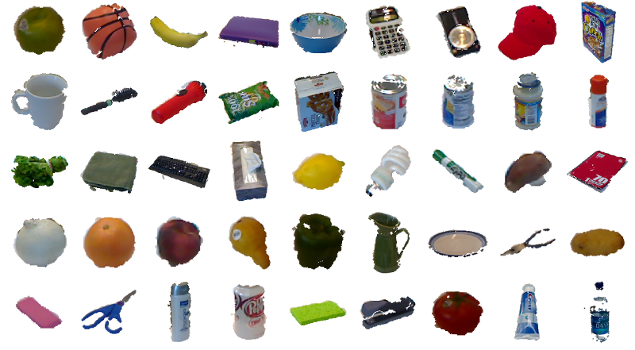
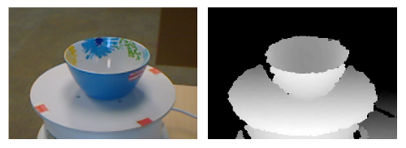
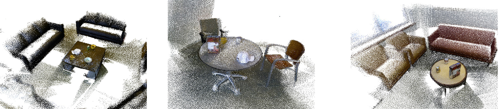

Trabalho Prático 2 - SAVI
==============
Miguel Riem Oliveira <mriem@ua.pt>
2022-2023

# Sumário

O trabalho **SAVI - Where's my coffee mug?** consiste na implementação de um sistema de perceção avançada que processe informação recolhida de sensores 3D e também de câmaras RGB convencionais.

O objetivo é detetar os objetos presentes numa cena, bem como estimar as suas propriedades.

# Dados

Os dados a utilizar são do Washington RGB-D Dataset. Há dois datasets distintos, o [RGB-D Object Dataset](https://rgbd-dataset.cs.washington.edu/dataset/) e o [RGB-D Scenes Dataset](https://rgbd-dataset.cs.washington.edu/dataset/).

### [RGB-D Object Dataset](http://rgbd-dataset.cs.washington.edu/dataset/)

Contém 300 objetos agrupados em 51 categorias.

Este dataset tem vários tipos de dados que podem ser utilizados de forma diferente. Neste dataset os objetos são visualizados isoladamente e é fornecida informação de ground truth (os labels) sobre a localização dos objetos nas imagens RGB, Depth e na point cloud. É também disponibilizada a pose dos objetos.

### [RGB-D Scenes Dataset](http://rgbd-dataset.cs.washington.edu/dataset/rgbd-scenes-v2/)

Este dataset contém 14 cenas com mobília (sofás e mesas) e um subgrupo dos objetos presentes do RGB-D Object Dataset (bowls, caps, cereal boxes, coffee mugs, and soda cans).
Este dataset contém anotações dos objetos na cena.

# Objetivos do trabalho

A avaliação será feita na apresentação do trabalho pelos alunos. Serão avaliadas várias vertentes do trabalho como descrito em baixo.

### Objetivo 1 - Treino de um classificador em deep learning

Pretende-se que o sistema desenvolvido seja capaz de detetar objetos na cena (em dados do RGB-D Scenes Dataset) e depois calcule várias propriedades dos objetos.

O RGB-D Object Dataset deve ser explorado e os seus dados utilizados para desenvolver uma rede de deep learning que consiga efetuar a classificação dos objetos.
Deve-se proceder à divisão do dataset em treino e teste (80% / 20%). Depois de treinada, deve ser possível calcular a precisão global e por classe.

### Objetivo 2 - Pre-processamento 3D

A ideia é desenvolver um sistema que processe a nuvem de pontos de uma cena (dados do RGB-D Scenes Dataset) e consiga isolar os objetos na nuvem de pontos. O sistema deve calcular várias propriedades dos objetos como:

- a cor,
- a altura,
- a largura,
- outras propriedades relevantes.

### Objetivo 3 - Classificação de objetos na cena

A segmentação de objetos nas nuvens de pontos que foi efetuada anteriormente pode ser utilizada para descobrir a zona onde está o objeto na imagem RGB. Daqui pode-se extrair uma sub-imagem que contenha apenas o objeto e dá-la à rede de classificação anteriormente desenvolvida.
Outra solução será treinar [uma rede de classificação que utilize informação tridimensional para o reconhecimento de objetos](https://openaccess.thecvf.com/content_cvpr_2018/papers/Zhou_VoxelNet_End-to-End_Learning_CVPR_2018_paper.pdf).

### Objetivo 4 - Descrição áudio da cena

A ideia é utilizar um sintetizador de discurso para que o sistema consiga descrever verbalmente a cena que lhe é mostrada, dizendo por exemplo: "A cena contém duas canecas, uma branca e outra azul, e uma caixa de cereais vermelha com altura de 15 centímetros."

### Objetivo 5 - Métricas de performance

Todos os algoritmos desenvolvidos deverão ser testados a apresentadas métricas de performance.
Em particular, para os detetores de objetos devem ser apresentadas métricas de [Precision, Recall e F1 Score](https://www.askpython.com/python/examples/precision-and-recall-in-python). Para problemas de classificação multi-class recomenda-se [este link](https://www.evidentlyai.com/classification-metrics/multi-class-metrics)

### Objetivo 6 - Sistema em tempo real

Utilizando uma câmara RGB-D em frente a uma mesa, experimente o sistema a correr em tempo real.

